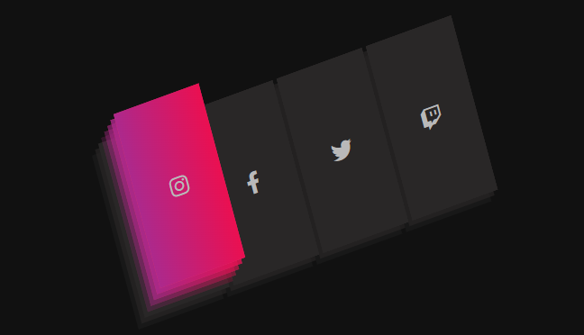

# 3D Social Link

Design aprimorado de 3D básico. O design conta com um componente visual de **links sociais em 3D**, desenvolvido exclusivamente com *HTML5* e *CSS3*, explorando transformações tridimensionais, empilhamento de camadas e suavização visual por meio de gradientes e sombras. 
Uso de transform, perspective e transition para criar interfaces interativas modernas sem dependência de JavaScript.

## Descrição do Design

O design simula cartões empilhados representando redes sociais (Instagram, Facebook, Twitter e Twitch). Ao interagir com cada item, ocorre:

* Translação progressiva das camadas internas;
* Variação de opacidade para reforçar a profundidade;
* Aplicação de gradientes animados específicos para cada rede social;
* Sensação de elevação e rotação nos eixos X e Y, reforçando o efeito tridimensional.

---


## Estrutura HTML

O HTML é propositalmente simples e reutilizável. Cada link social é composto por um elemento <a>a</a> contendo múltiplos <a>span</a>, responsáveis pelas camadas visuais do efeito 3D.

```
<ul class="social-links">
    <li>
        <a href="#">
            <span></span>
            <span></span>
            <span></span>
            <span></span>
            <span class="fab fa-instagram"></span>
        </a>
    </li>
</ul>
```
Os ícones não são imagens rasterizadas, mas **glifos vetoriais**, o que garante escalabilidade e melhor desempenho.

## Demonstração visual
<video controls src="elevacao-icones.mp4" title="Title"></video>